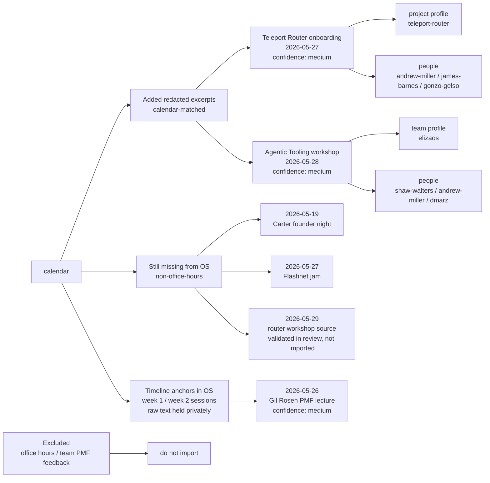

# Reviewed Transcript Import Map

> **Status 2026-06-13:** This is now a historical week 1/2 import map. Use
> [Transcript Calendar Coverage Index](transcript-calendar-coverage-index.md)
> for the current complete calendar coverage list, missing-session queue,
> candidate-review queue, and transcript naming audit. The newer index is
> generated from the current calendar plus private transcript vault plans.

This is the review map for the current Shape Rotator OS transcript audit. It separates existing OS coverage from candidate transcript files that match calendar events but should not be submitted raw until their content boundary is approved.

> **2026-06-10 content-boundary update.** Raw transcripts no longer live in this public repo. Per the content policy (raw transcripts are never published beyond attendees), the 13 raw .txt files were removed from `apps/os/src/content/context/raw-scripts/` and moved to the private vault. Their historical canonical-timeline anchors lived in `apps/os/src/content/context/calendar-transcript-matches.js` as `held: "private-vault"` sources carrying a `vault_id` join key and a snapshot of person/team mention hits. Use the current [Transcript Calendar Coverage Index](transcript-calendar-coverage-index.md) for live coverage status.
>
> **Insights pipeline.** Each vault transcript gets a public-safe distilled readout, hardcoded via `npm run ingest:readouts <readouts.json>` ([ingest-session-readouts.mjs](../scripts/ingest-session-readouts.mjs)): canonical structured readouts land in [session-insights.json](../cohort-data/session-insights.json) (shipped in the app surface as `session_insights`), per-team cues append to [constellation-cues.json](../cohort-data/constellation-cues.json) (rendered in constellation inspectors today), and human-readable review copies land in [session-readouts/](../cohort-data/session-readouts/). Sessions with external or featured speakers carry `consent: speaker-pending` and are held to thematic, unattributed distillation until a speaker consent pass.

## Visual Map

## Confidence Scale

| confidence | meaning |
|---|---|
| high | Calendar date/title and transcript file clearly describe the same session. |
| medium | Date and topic line up, but the transcript spans a broader conversation, an adjacent block, or a segment inferred from surrounding context. |
| low | Do not link. The match is too weak for the app surface. |

## Historical Bundled Public-Safe Files

These were the transcript-derived files referenced by the week 1/2 import review. They are retained here as historical names, not live file links. Use the current [Transcript Calendar Coverage Index](transcript-calendar-coverage-index.md) for live coverage and source status.

| file | calendar match | confidence | boundary decision |
|---|---|---:|---|
| `Teleport Router Onboarding Privacy Boundaries May 27 Redacted Transcript` | `2026-05-27` Teleport Router onboarding / Q&A | medium | Redacted excerpt only. Raw private PMF/product feedback and customer/business detail are not imported. |
| `Agentic Tooling Workshop May 28 Redacted Transcript` | `2026-05-28` Agentic Tooling workshops/clinic | medium | Redacted excerpt only. Raw product/investor-style feedback and private event planning are not imported. |
| `WDYDLW Standup Recap June 8 2026` | `2026-06-08` WDYDLW with Shaw | high | Distilled reconstructed recap, not a verbatim transcript. Source capture stays private. |

## Calendar Coverage

Office-hours links are intentionally excluded. This table covers the substantive non-office-hours calendar blocks that have a timeline anchor in the OS. "held privately" means the raw text lives in the private vault and only the anchor + mention snapshot are committed, keyed by `vault_id`.

| date | calendar block | confidence | source |
|---|---|---:|---|
| `2026-05-19` | Project intros&workflow | high | held privately — `day1-project-intros-notes-2026-05-19` |
| `2026-05-20` | Tutorial: Dstack | high | held privately — `dstack-intro-salon-2026-05-20` |
| `2026-05-20` | Project Intros: Local/Private first | high | held privately — `project-intros-local-private-first-phil-2026-05-20` |
| `2026-05-20` | Phil Daian founder journey | medium | held privately — `project-intros-local-private-first-phil-2026-05-20` |
| `2026-05-21` | Dumb agent tricks | high | held privately — `dumb-agent-tricks-2026-05-21` |
| `2026-05-21` | Project Intros: Agentic | high | held privately — `project-intros-agents-day3-2026-05-21` |
| `2026-05-22` | Project Mappings | high | held privately — `shape-rotator-project-map-guests-2026-05-22` |
| `2026-05-22` | PMF Roast | medium | held privately — `friday-shaw-greg-2026-05-22` |
| `2026-05-22` | Founders Journey w/ Shaw | medium | held privately — `friday-shaw-greg-2026-05-22` |
| `2026-05-26` | Project Intros: Elocute, Dealproof, Wikigen, Crossroads | high | held privately — `elocute-2026-05-26`, `wikigen-crossroads-gil-pmf-2026-05-26` |
| `2026-05-26` | Lecture: Defining Product Market Fit, Gil Rosen | medium | held privately — `wikigen-crossroads-gil-pmf-2026-05-26` |
| `2026-05-27` | Teleport Router onboarding / Q&A | medium | bundled redacted excerpt |
| `2026-05-27` | Ideal Customer Profiling / User Interviews | high | held privately — `icp-user-interviews-2026-05-27` |
| `2026-05-28` | Agentic Tooling workshops/clinic | medium | bundled redacted excerpt |
| `2026-06-08` | WDYDLW with Shaw | high | bundled distilled recap |

## Held Privately, No Timeline Anchor

These raw files were removed from the repo and are not referenced by any calendar match (no timeline impact). They stay in the private vault pending a distillation pass or remain excluded.

| file | note |
|---|---|
| Office Hours Transcript | Office-hours material is excluded from the OS by policy. |
| TEE dstack easyTEE Phala Transcript | No matched calendar block in the current map. Candidate for a future distill + anchor. |
| dstack hangout Alex Shaw Lsdan Andrew | Informal hangout, no matched calendar block. Candidate for a future distill + anchor. |

## Missing Or Unresolved

These calendar blocks do not currently have a transcript source. They should not block the work above, but they are the remaining audit gaps if the goal is full week 1/2 calendar coverage.

| date | calendar block | OS status | next action |
|---|---|---|---|
| `2026-05-19` | Founder night - Carter Cleveland | Event exists as [Carter Cleveland founder journey](../cohort-data/events/2026-05-19-carter-cleveland-founder-journey.md), but no transcript anchor is linked. | Add a held-private anchor only if a reviewed recording/transcript exists. |
| `2026-05-27` | Flashnet jam | No matched transcript file found. | Look for a reviewed jam transcript or leave unlinked. |
| `2026-05-29` | router onboarding/workshop | Prior review identified a likely Router/Hermes transcript, but the reviewed file is not in the vault inventory. | Anchor only if the reviewed transcript is recovered; do not substitute office-hours material. |

## Ignored For This Submission

These are intentionally out of scope: office-hours blobs, 1:1 material, private team PMF/GTM/fundraising feedback, private customer/company examples, private event-planning details, and sorting-hat dinner material. This is a confidence-high exclusion: they either do not map to the requested calendar workshop/lecture blocks or require explicit private-boundary approval before becoming OS context.

## Content Boundary Rules

1. **Raw transcripts never enter the public repo or the app bundle.** They live in the private vault. The public repo carries only the timeline anchor (`held: "private-vault"`, `vault_id`, mention snapshot) in `calendar-transcript-matches.js`.
2. Public-safe redacted excerpts and distilled recaps may be bundled when the session context is worth surfacing, following the May 27/28 redacted-excerpt pattern: preserve calendar/session context, strip private PMF, GTM, fundraising, positioning, customer/company, and team-specific product feedback.
3. Distilled insights for the cohort (readouts, abridged transcripts, Q&A) belong on a password-gated cohort surface, not in this repo. Public-facing distillations additionally require speaker/attendee consent.
4. When in doubt, hold the raw transcript and ship only the anchor.
